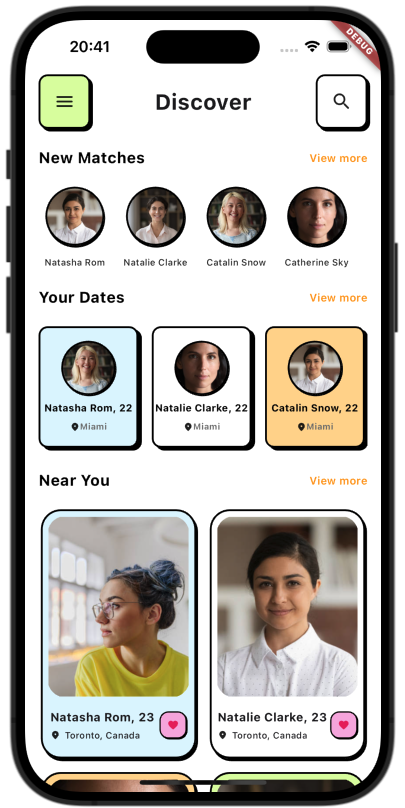
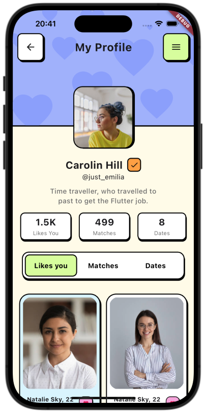
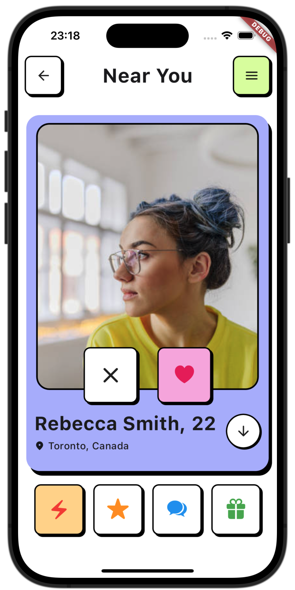
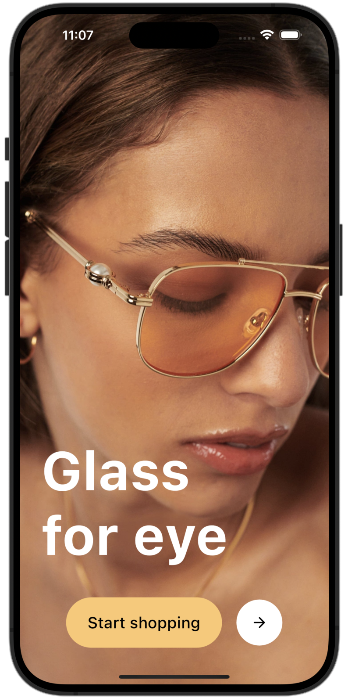
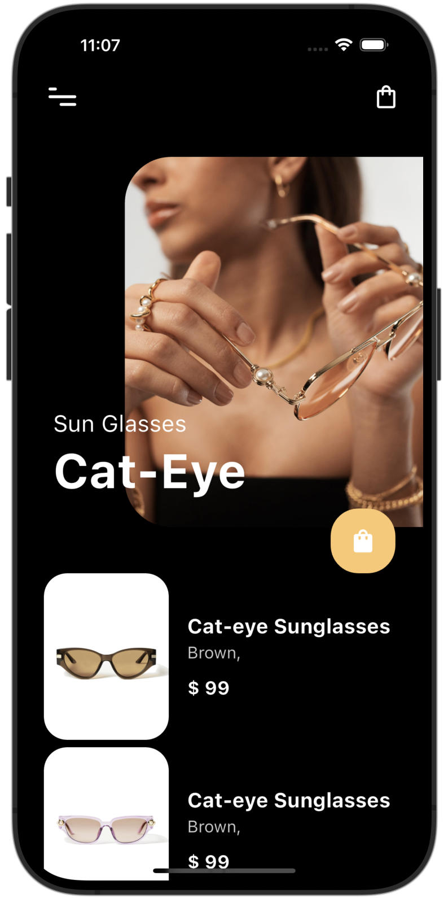
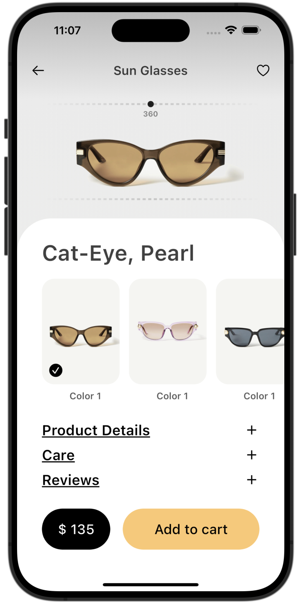
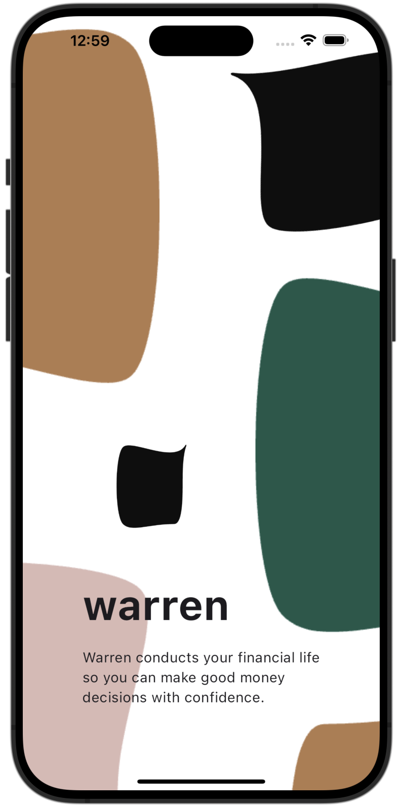
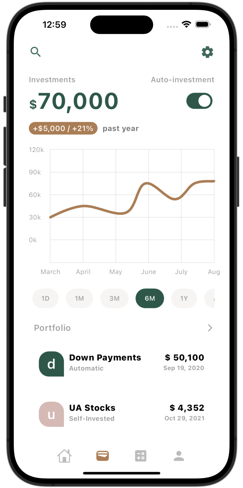
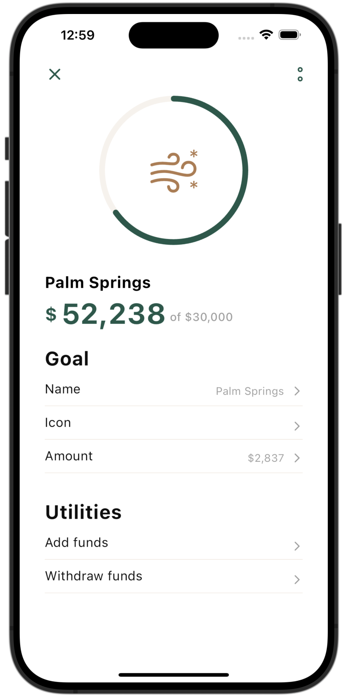
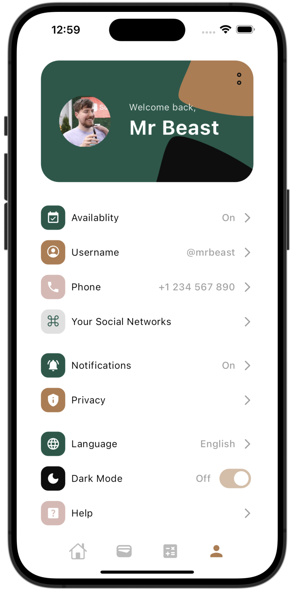

## Collection of UIs made in Flutter
### Drop a start ⭐️ if you find it useful.

# 1. Dating App

  

# 2. Sun Glasses Store

  

# 3. Banking

  
 
  

# 4. Architect UI

# 5. Furniture Store

